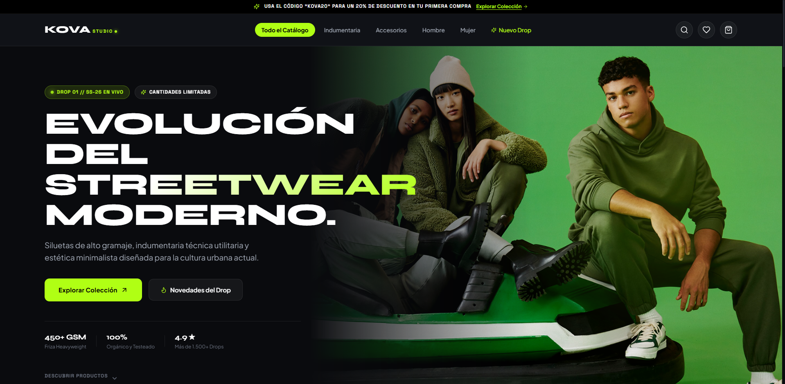
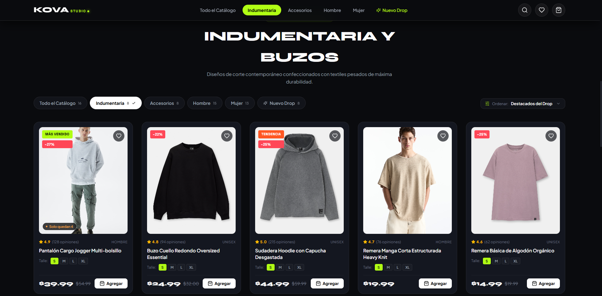
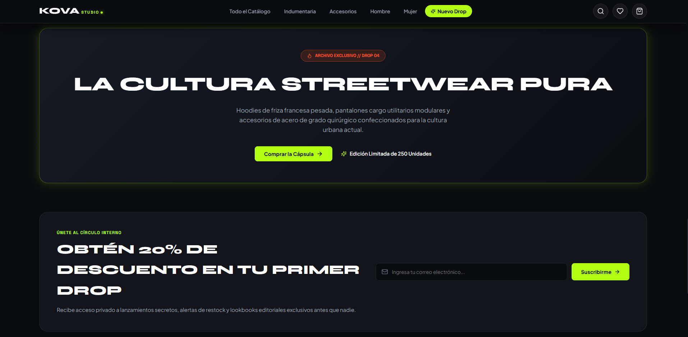
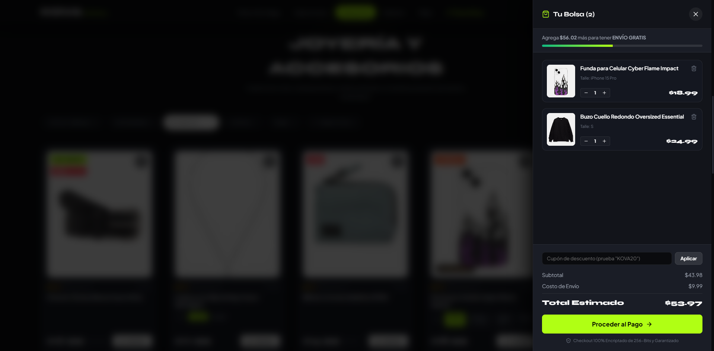

# KOVA STUDIO •
### Streetwear & Alta Cultura Urbana 2026

*Plataforma e-commerce de indumentaria streetwear contemporánea con cortes arquitectónicos, estética dark glassmorphism y micro-interacciones de alta fidelidad.*

---

## 📸 Galería del Proyecto

|  |  |
|:---:|:---:|
| **Hero Section & Nuevos Drops** | **Catálogo con Filtros Personalizados** |

|  |  |
|:---:|:---:|
| **Quick View & Detalle de Prenda** | **Carrito Lateral & Checkout en Vivo** |

---

## ✨ Experiencia y Funcionalidades

- **⚡ Dirección de Arte & Estética Urbana:** Paleta cromática monocromática profunda con acentos en verde neón, tipografías display de alto impacto y acabados en *glassmorphism*.
- **🎬 Animaciones Cinematográficas GSAP:** Efectos de entrada secuenciales, parallax dinámico en scroll, contadores numéricos interactivos e integración con ScrollTrigger.
- **🔍 Catálogo Dinámico & Filtros Avanzados:** Sistema de filtrado por categoría (Indumentaria, Accesorios, Hombre, Mujer, Drops) y selector personalizado de ordenamiento por precio, valoración o novedad.
- **🛍️ Quick View Modal & Talles:** Modal interactivo para inspección rápida de productos, selección de talles, badges de stock limitado y cálculo de cuotas sin interés.
- **🖤 Carrito Lateral & Favoritos:** Drawer interactivo con cálculo automático de envíos gratis, gestión de cantidades, persistencia de lista de deseos y confirmación de compra.
- **📱 Responsive & Mobile First:** Experiencia fluida y consistente en smartphones, tablets y pantallas de escritorio.

---

## 🛠️ Stack Tecnológico

- **Frontend:** React 18 + TypeScript
- **Bundler & Tooling:** Vite
- **Animaciones:** GSAP + ScrollTrigger
- **Iconografía:** Lucide React
- **Estilos:** Vanilla CSS con variables de diseño, Glassmorphism y Flex/Grid layouts

---

Diseñado para la cultura urbana actual.  
**Desarrollado por [WaveFrame Studio](https://waveframe.com.ar/)**

